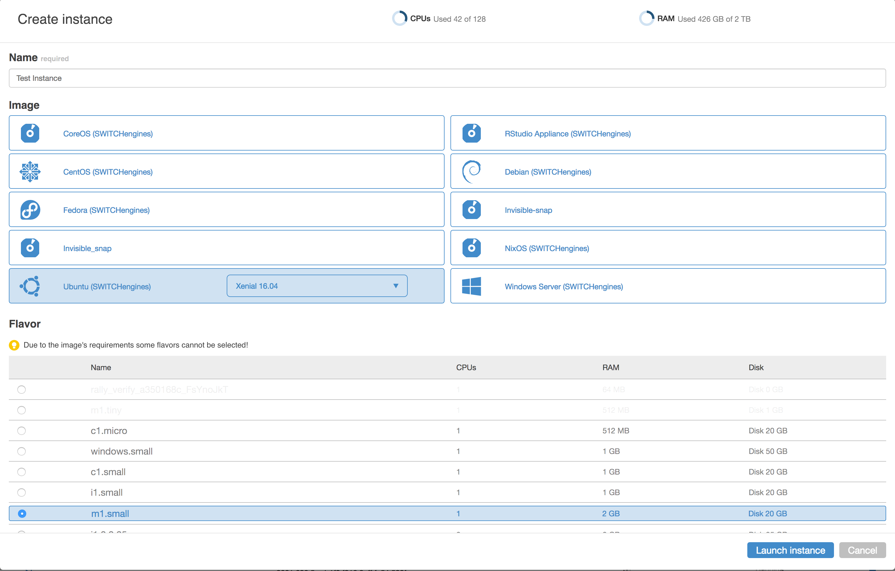

# Quickstart UI for Openstack Horizon

This dashboard for Openstack's Horizon frontend aims to facilitate the creation
of VMs for users. It takes the burden to know network and firewall configurations
from the user and provides a simple interface to create a VM with a few clicks.



Features:

* One single dialog for VM creation
* Grouping of Images (by OS type)
* Selection of relevant flavors
* Creation / selection of SSH keypair if using Linux image
* Automatic creation of SSH / RDP Security Group based on Linux/Window image
* Apply correct security group to VM
* Automatically create private network
* Automatically assign floating IPv4 address
* Help with creating / attaching additional volumes
* Display login (SSH information)

Quickstart has been tested with Horizon Pike.

## Quickstart Installation with pip

### Installing as a module

    sudo pip install -e <your-gitrepo>#egg=sw-openstack-quickstart

    Change in openstack_dashboard/local/local_settings.py

    For debugging disable compression:

        COMPRESS_OFFLINE=False
        COMPRESS_ENABLED=False


    Configure the Email for outgoing mails:
        EMAIL_BACKEND = 'django.core.mail.backends.smtp.EmailBackend'

        # Configure these for your outgoing email host

        EMAIL_USE_TLS = True
        EMAIL_HOST = 'smtp.yourhost.com'
        EMAIL_PORT = 587
        EMAIL_HOST_USER = 'info@stack.ch'
        EMAIL_HOST_PASSWORD = 'secret'
        DEFAULT_FROM_EMAIL = 'info@stack.ch'


    copy _10_quickstart.py to /opt/stack/horizon/openstack_dashboard/enabled/

    change the settings accoriding to your setup:

        UPDATE_HORIZON_CONFIG = {
            'SW_EMAIL_FROM': 'engines-support@switch.ch',
            'SW_OS_COMPUTE_API_VERSION': 2, #Version of the nova client
            'SW_SEND_VM_CREATED_NOTIFICATION': True #True if emails should be sent upon VM creation.
    }


    collect static:
        python manage.py collectstatic --noinput

    restart apache:
        sudo apache2ctl restart

## Installing on SWITCHengines controller

    install pip (maybe via `apt-get install python-pip`)

    change /etc/openstack-dashboard/local_settings.py

    sudo cp ~/src/sw-openstack-quickstart/quickstart/_10_quickstart.py /usr/share/openstack-dashboard/openstack_dashboard/enabled
    sudo apt-get install python-dev
    sudo pip install oslo.serialization==1.2.0

    The following 2 commands are only required if you have a db and you haven't initialized before
    sudo python /usr/share/openstack-dashboard/manage.py syncdb
    # sudo python /usr/share/openstack-dashboard/manage.py migrate quickstart

    sudo python /usr/share/openstack-dashboard/manage.py collectstatic --noinput
    sudo apachectl2 restart

## Installation via fabric

### Building and deploying QuickstartDashboard

    env$ fab <env> deploy
    env$ fab pawel deploy:dry_run=True


### Quickstart Dashboard paths
    #### Basepath
        cd /opt/stack/horizon

    #### Dashboard config
        cd /opt/stack/horizon/openstack_dashboard/local

    #### Quickstart Dashboard
        cd /opt/stack/horizon/openstack_dashboard/dashboards/quickstart

    #### Settings
        cd /opt/stack/horizon/openstack_dashboard/local


### Building the application module with disttools

    python setup.py sdist


## Initial devstack installation

### Get devstack code

    sudo apt-get install git
    git clone https://git.openstack.org/openstack-dev/devstack

    create local.conf in devstack folder:
        cat << “EOD” > local.conf
        [[local|localrc]]
        ADMIN_PASSWORD=<PASSWORD>
        DATABASE_PASSWORD=$ADMIN_PASSWORD
        RABBIT_PASSWORD=$ADMIN_PASSWORD
        SERVICE_PASSWORD=$ADMIN_PASSWORD
        SERVICE_TOKEN=a682f596-76f3-11e3-b3b2-e716f9080d50
        #FIXED_RANGE=172.31.1.0/24
        #FLOATING_RANGE=192.168.20.0/25
        HOST_IP=<IP>
        #neutron config
        disable_service n-net
        enable_service q-svc
        enable_service q-agt
        enable_service q-dhcp
        enable_service q-l3
        enable_service q-meta
        # Optional, to enable tempest configuration as part of devstack
        enable_service tempest
        EOD

    Replace <IP> with IP of your machine (if you run it behind a NAT use the private IP).

### To install a specific relase

    git checkout stable/juno

    otherwise you'll install the master tree

    cd devstack; ./stack.sh

    Runs installation scripts → /opt/stack

    cd /opt/stack/horizon/
    ./run_tests.sh

### Install custom dashboard (covered by the fabric deployment)

    copy the content of this repo to /opt/stack/horizon/openstack_dashboard/dashboards/

    copy quickstart/_10_quickstart.py to /opt/stack/openstack_dashboard/enabled/

    Also for better debugging add. Otherwise set to true:

        COMPRESS_OFFLINE=False
        COMPRESS_ENABLED=False

    from /opt/stack/horizon run

    yes yes | python manage.py collectstatic && sudo apache2ctl restart && date

## Customization

### Image metadata

With help of metadata the display of images and the UI’s behaviour can be controlled. The following metadata keys are available:

- **os_flavor**: Type of OS (“Windows”, “Ubuntu”, …). Image categories using this name will be added to the UI.
- **os_version**: The OS' version e.g. “Trusty 14.04”. This information will be displayed in the UI.
- **default_user**: The default user for the OS. This information will be presented to the user
- **requires_ssh**: If set to “true” it indicates that a SSH rule must be added in order to create an instance. If set to “false” it indicates that the OS does not requires a keypair. In this case the field in the form will be hidden!
- **requires_rdp**: Indicates if a RDP rule must be added in order to create an instance. The value can be “true” or “false”. See **requires_ssh**.

### Frontend

**Only applicable if your WEBROOT is other than '/horizon/'**.
In order to have the correct `WEBROOT` the frontend code needs to be rebuilt.

1. Run `npm install` from Quickstart's root directory
2. Copy `webroot.json.example` to `webroot.json`.
3. Change the `webroot` property in `webroot.json` to reflect your setup.
4. Run `grunt build` (Rebuilds the JS bundle and copies everything to the Django code)

### Text & Translations

In order to change the texts or to add new languages run:

1. Run `.tox/<required python version>/bin/django-admin makemessages -l <lang>`
2. Add/Replace your text in `quickstart/locale/<lang>`. You might want to change the following text in `django.po`:
- “Your SWITCHengines-Team”
- “[SWITCHengines] New Instance created”
and in `djangojs.po`:
- “More on <a href=\"http://help.switch.ch/engines/faq/\" target=\"_blank"
"\">mounting a volume</a>.”
- “Read more in the <a href=\"http://help.switch.ch/engines/faq/how-do-i-start-"
"a-windows-vm/\" target=\"_blank\">FAQs</a>.”

### Icons
All icons are located in Quickstart’s `static/quickstart/fonts` directory.

## Development

For development the easiest setup is to run Horizon and the Quickstart UI on the local development machine.

### Setup

1. Checkout [Openstack Horizon](https://github.com/openstack/horizon)
2. From Horizon’s root directory run `tox`. This will install the required Python packages.
3. Checkout Quickstart UI’s code to `openstack_dashboard/dashboards`
4. Add the Quickstart UI to the installed Python packages: `.tox/<required python version>/bin/pip install -e <path to horizon>/openstack_dashboard/dashboards/<quickstart directory>/`
5. Copy `<path to horizon>/horizon/openstack_dashboard/dashboards/<quickstart directory>/quickstart/_10_quickstart.py` to `<path to horizon>/horizon/openstack_dashboard/enabled`
6. Change the `UPDATE_HORIZON_CONFIG` settings in `_10_quickstart.py`
7. Create a `<path to horizon>/horizon/openstack_dashboard/local/local_settings.py` according to your setup. `<path to horizon>/horizon/openstack_dashboard/local/local_settings.py,example` is a good starting point.
8. Make sure that `COMPRESS_OFFLINE` is set to `False`
9. Rebuild the frontend with the correct WEBROOT set (see above).
10. Run from `.tox/<required python version>/bin/python manage.py runserver` Horizon’s main directory. This runs the Django webserver
11. From Quickstart’s root directory run `grunt watch`. This will copy the JS code to the Django’s static folder if any file in the `app` directory is altered.


### Testing

For backend tests run (from horizon root):

```
.tox/<required python version>/bin/python manage.py test quickstart --settings=horizon.test.settings
```

and for Angular run (from horizon root):

```
./node_modules/.bin/karma start openstack_dashboard/karma.conf.js --single-run
```

or for npm > 5.2

```
npx karma start openstack_dashboard/karma.conf.js --single-run
```

## Todos

* Remove WEBROOT setting from Gruntfile. Use WEBROOT from the horizon config, so that no rebuild of the JS code is required.
* Follow [Openstack AngularJS Guide](https://docs.openstack.org/horizon/latest/contributor/topics/angularjs.html)
* Include JS Tests in code base, not Django’s static directory
* Refactor swCreateInstanceForm
* Convert Angular directives to components
* Increase test coverage
